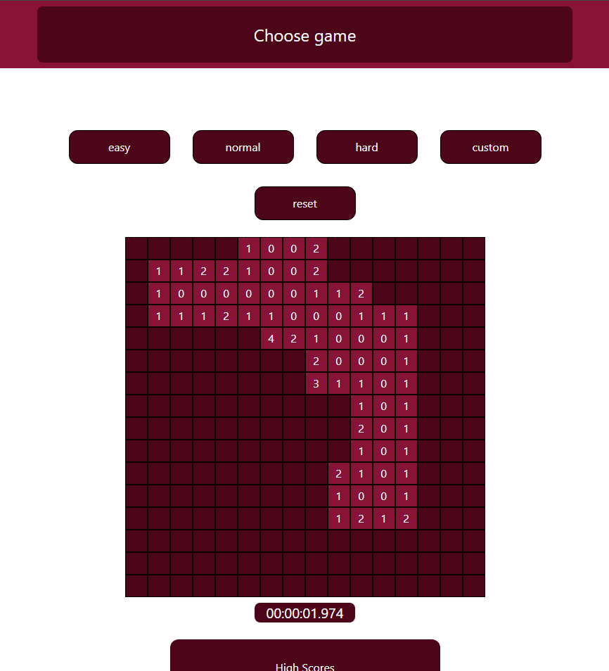
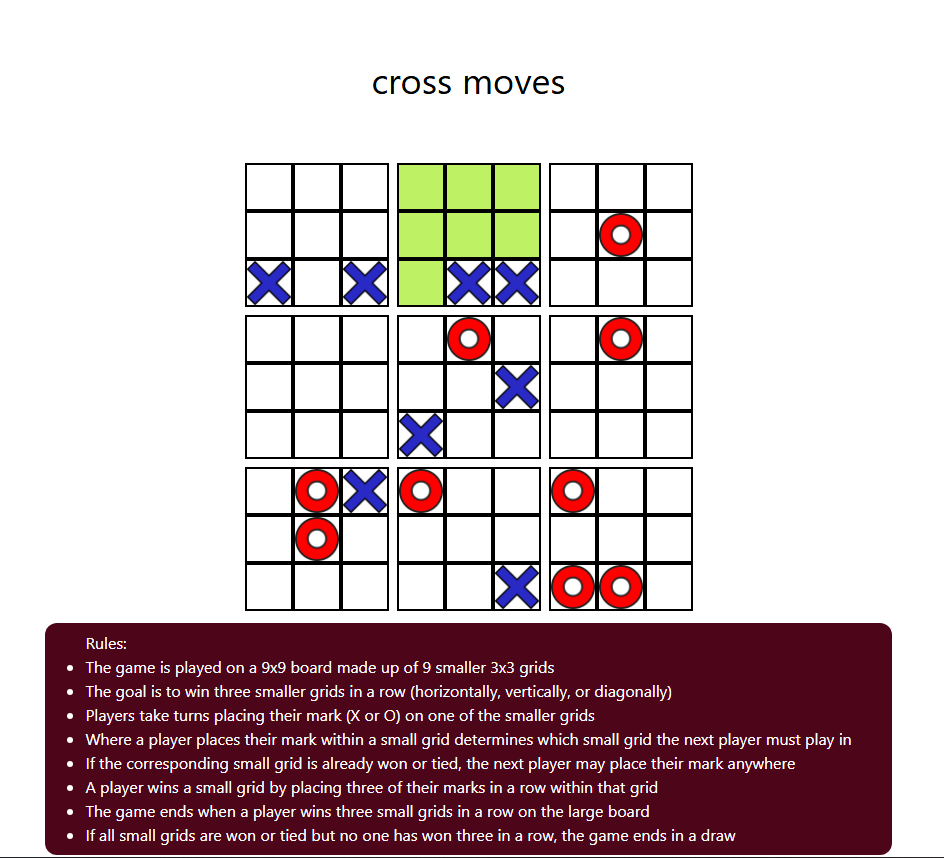
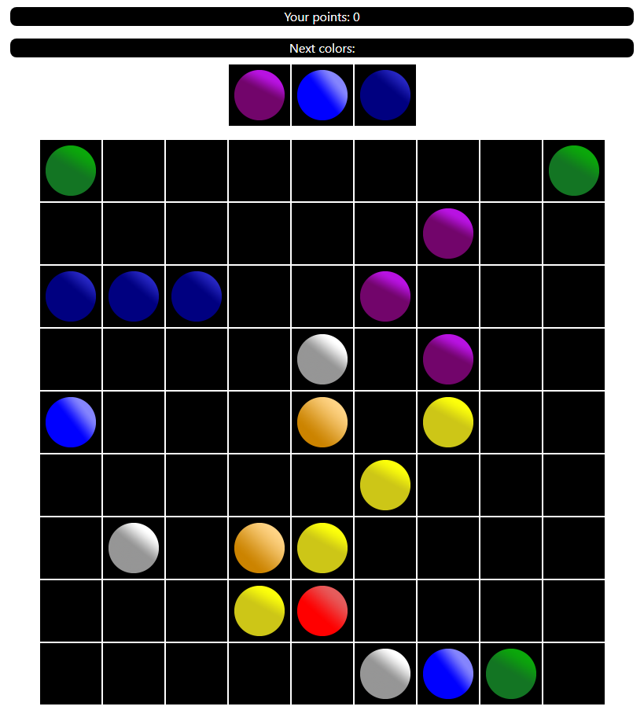
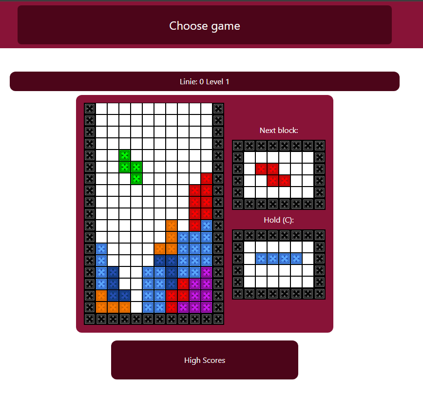
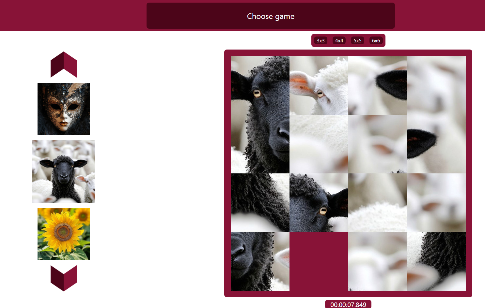

# Gry Gacek 🎮🕹️
## an Angular and Tailwind CSS frontend paired with a Spring Boot backend project, featuring the implementation of five simple games:
* ## Mineswepper
  
* ## Super Tic Tac Toe
 
* ## Game of kulki
  
* ## Tetris
  
* ## Click and slide
   

# Installation

## Backend
1. Insert the correct database configuration in `application.properties` located at:  
   `src/main/resources/application.properties`.

2. Clone the repository and navigate to the backend folder:
   ```bash
   git clone https://github.com/michelangelo-source/GryGacek
   cd ./back/GryGacekBackend/
3. Install Maven dependencies and run the application:
   - Install dependencies:
     ```bash
     mvn install
     ```
   - Run the application by executing `GryGacekBackendApplication.java` located in:
     `src/main/java/grygacek/grygacekbackend`
    
## Frontend

1. Navigate to the frontend folder:
  ```bash
  cd ./front/GryGacek/
  ```
2. Install the required dependencies:
  ```bash
  npm install
  ```
3. Start the development server:
  ```bash
  npm start
  ```
4. Open your browser at http://localhost:4200/ and enjoy the application!
